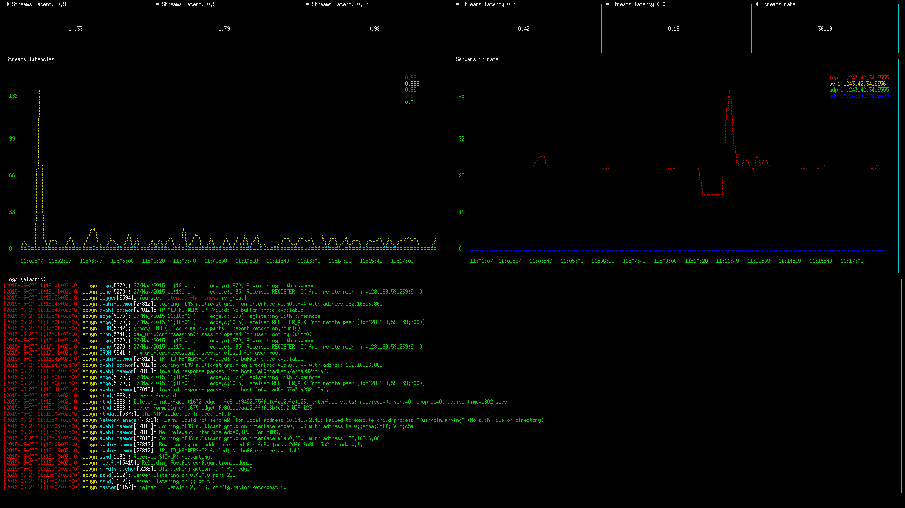

potential-happiness
===================

A dashboard for the terminal, for use with
[riemann](http://riemann.io/) and/or
[elasticsearch](https://www.elastic.co/products/elasticsearch).

Demo
----

**Riemann server statistics & local logs**


([source code][demo:1:source])

**System health & network monitoring**


([source code][demo:2:source])

 [demo:1:source]: https://raw.githubusercontent.com/algernon/potential-happiness/master/examples/local-log.js
 [demo:2:source]: https://raw.githubusercontent.com/algernon/potential-happiness/master/examples/madhouse-project.org.js

Installation
------------

```shell
git clone https://github.com/algernon/potential-happiness.git
cd potential-happiness
npm install
src/dashboard.js examples/local-log.js
```

For the `examples/local-log.js` example to work, one will need
[Riemann][riemann] and [ElasticSearch][elasticsearch] installed and
running. The former also needs to be configured to accept WebSocket
connections.

License
-------

Copyright (C) 2015 Gergely Nagy <algernon@madhouse-project.org>,
released under the terms of the
[GNU General Public License][gpl], version 3+.

 [gpl]: http://www.gnu.org/licenses/gpl.html
